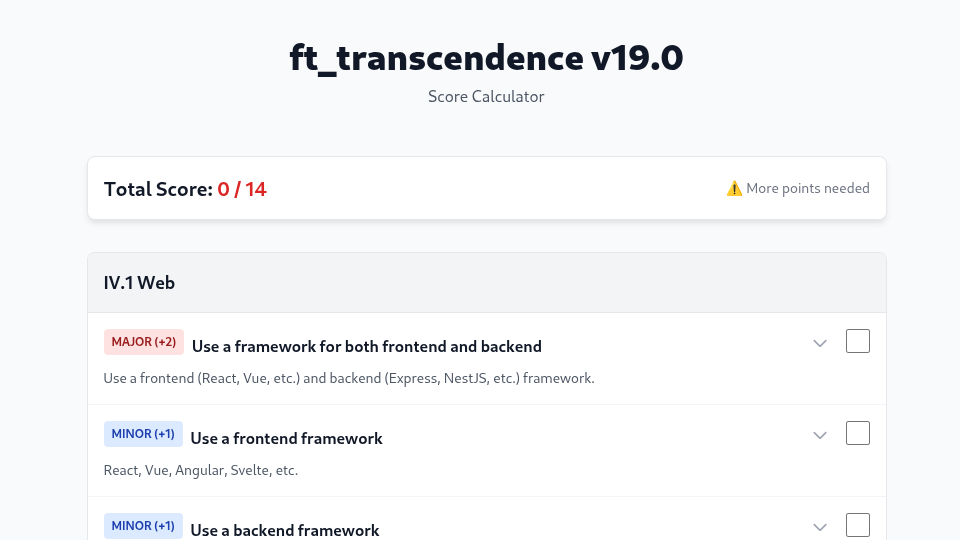

# ft_transcendence Calculator & Planner

A comprehensive tool designed for 42 students to plan their **ft_transcendence** project, track their score, and organize team responsibilities.

## 🚀 Live Demo
[**Use the Calculator Here**](https://ft-trans.netlify.app/)

## ✨ Features

* **Score Calculation:** Automatically tracks Major (+2) and Minor (+1) modules to ensure you hit the required **14 points**.
* **Team Assignments:** Assign specific modules to team members (supports teams of 4-5) using color-coded selectors.
* **Smart Summary:** Generates a formatted text summary of the project plan, grouped by student, ready to copy-paste into Discord or Slack.
* **Persistent Data:** Autosaves your progress to the browser's local storage so you never lose your plan.
* **Dark Mode:** Built-in toggle for late-night planning sessions.
* **Responsive Design:** Works seamlessly on desktop and mobile.

## 🛠️ Usage

1.  **Select Modules:** Click on a module to expand details. Use the color dots to assign the module to a specific student (Green, Blue, Purple, Orange, Pink).
2.  **Check Score:** Watch the sticky header to see your total score update in real-time.
3.  **Generate Plan:** Click **"Copy Summary"** in the header to get a clipboard-ready breakdown of who is doing what.
4.  **Reset:** Use the reset button to clear all selections and start over.

## 👤 Author

**asadiqui**

* [GitHub](https://github.com/asadiqui)
* [LinkedIn](https://www.linkedin.com/in/asadiqui)
* [Linktree](https://linktr.ee/lmodir)

---
*This project is not affiliated with 42 Network directly.*